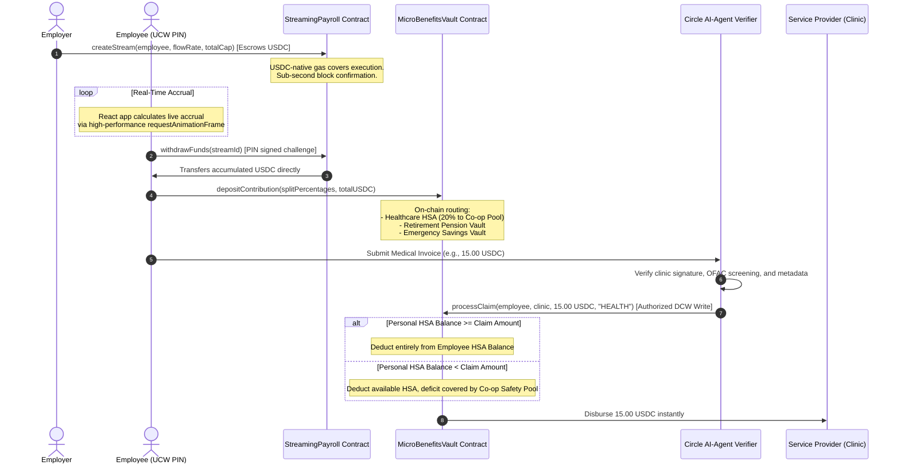

# NexaFlow — Autonomous Continuous Payroll & Decentralized Micro-Benefits Ledger
### Deployed on Arc Testnet (USDC-native Gas Chain) & Circle UCW/DCW Services

NexaFlow is an enterprise-grade, Web3 payroll and micro-benefits platform built natively on **Arc Testnet** (where USDC is the native gas asset). It replaces legacy, rent-seeking batch banking processes (SWIFT, high FX spreads, manual pension integrations) with **real-time per-second continuous payroll streams** and **AI-agent authenticated health and retirement benefits splits**.

By uniting per-second streaming liquidity with automated, AI-agent verified micro-benefits disbursements under a sub-second, deterministic finality model, NexaFlow establishes a secure, highly scalable, and regulatory-compliant stablecoin commerce stack for the global remote workforce.

---

## 🏗️ System Architecture & Workflow

The following sequence diagram outlines the interaction model between the Employer, the Employee, the autonomous Smart Contracts, the Sandboxed AI Verifier Agent, and Circle User-Controlled Wallets:



---

## 🌟 Key Features

1. **Continuous Real-Time Payroll**: Streaming wages to global contractors on a per-second basis, backed by on-chain escrow locks.
2. **Circle User-Controlled Wallets (UCW)**: True non-custodial employee wallets secured by user PIN challenges via Circle's Web Enclave SDK.
3. **Circle Developer-Controlled Wallets (DCW)**: Automated treasury management executing secure, programmatically signed micro-benefits transfers.
4. **Community Co-op Safety Pool**: Risk-pooling algorithm where 20% of HSA splits cover member deficits for emergency healthcare claims.
5. **AI-Agent Compliance Guard**: LangGraph-powered verification agent validating invoice metadata and performing sanctions screening prior to clearing payouts.
6. **Sub-second Gasless Claims**: Native USDC gas on Arc Chain coupled with paymaster signature delegation for zero-friction user claims.

---

## 🚀 Quick Start (Local Setup)

Clone the repository and run all stack layers concurrently:

### 1. Installation
```bash
git clone https://github.com/your-username/NexaFlow.git
cd NexaFlow
npm install
```

### 2. Environment Configuration
Create a `.env` file in the root folder using the provided template:
```bash
cp .env.example .env
```
Ensure you set your `CIRCLE_API_KEY`, `CIRCLE_APP_ID`, `PRIVATE_KEY`, and `SUPABASE_URL` to enable all core protocol services.

### 3. Launching NexaFlow
Start the React App, the AI Agent server, and the Circle UCW/DCW backend concurrently:
```bash
npm run dev:all
```
Your local services will launch at:
* **Frontend Client**: `http://localhost:3000` (or next free port)
* **Circle UCW/DCW Treasury Service**: `http://localhost:3011`
* **Agent Coordinator Server**: `http://localhost:3012`

---

## 📄 Protocol Primitives & Mathematical Formulations

### Continuous Streaming Payroll
Payroll is modeled as a continuous mathematical function of elapsed time:

$$A(t) = \min \left( (t - t_{last}) \times \gamma, \; C - P_{claimed} \right)$$

Where:
* $\gamma$ is the flow rate (USDC per second).
* $C$ is the total escrowed capital cap.
* $t_{last}$ is the timestamp of the last claim.
* $P_{claimed}$ is the total claimed salary.

### Embedded Micro-Benefits Splitting
When a USDC contribution $V_{total}$ is deposited, splits are routed on-chain:

$$V_{retirement} = V_{total} \times S_{retirement}$$
$$V_{emergency} = V_{total} \times S_{emergency}$$

For Healthcare allocation, a **Co-op contribution routing fee** funds the shared pool:
$$B_{member}^{HSA} \leftarrow B_{member}^{HSA} + \left( V_{total} \times S_{health} \times 0.80 \right)$$
$$T_{coop} \leftarrow T_{coop} + \left( V_{total} \times S_{health} \times 0.20 \right)$$

---

## 🔒 Security & Verification Invariants

1. **Escrow Solvency Guarantee**:
   $$\text{Balance}_{USDC}(\text{Contract}) \ge \sum_{i=1}^{N} \left( C_i - P_{claimed, i} \right)$$
2. **Verifier Signature Restrictions**: Only the designated AI agent verifier address is authorized to execute `processClaim()`.
3. **EVM Decimal Conversions**: Maintains 6 decimals for ERC-20 token storage/accounting while using 18 decimals natively for Arc Chain gas estimations.

---

## 📜 Deployed Addresses (Arc Testnet)

* **USDC Token**: `0x3600000000000000000000000000000000000000`
* **StreamingPayroll**: Deployed at `0x0747EEf0706327138c69792bF28Cd525089e4583`
* **MicroBenefitsVault**: Deployed at `0x8004A818BFB912233c491871b3d84c89A494BD9e`

---

## ⚖️ License
Licensed under the [MIT License](LICENSE).
