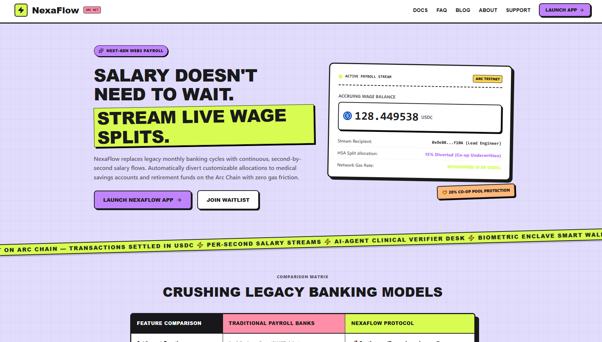
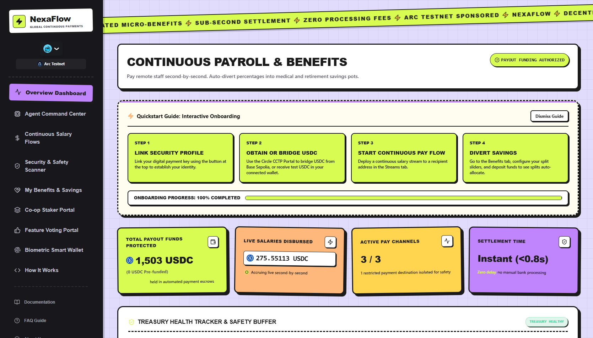
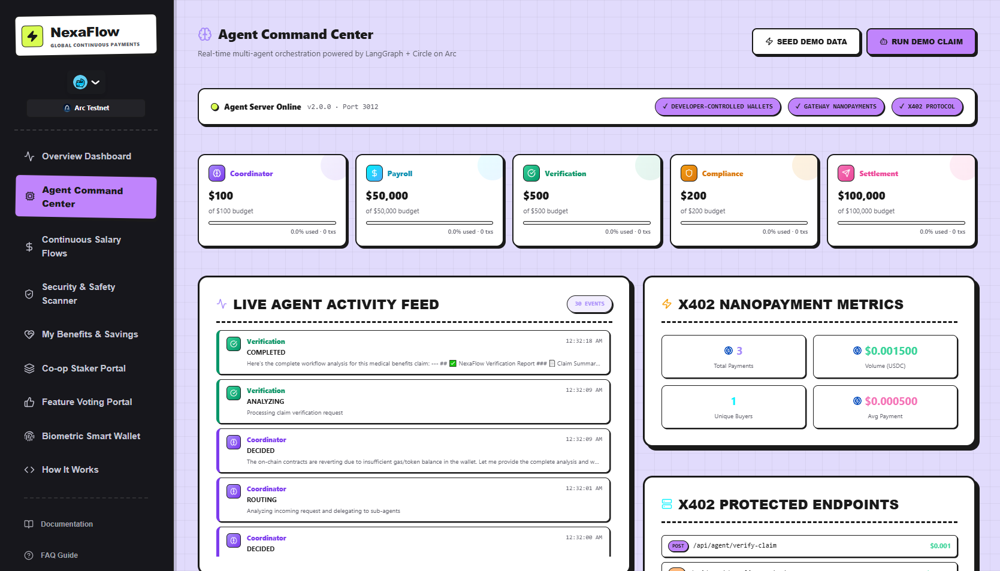
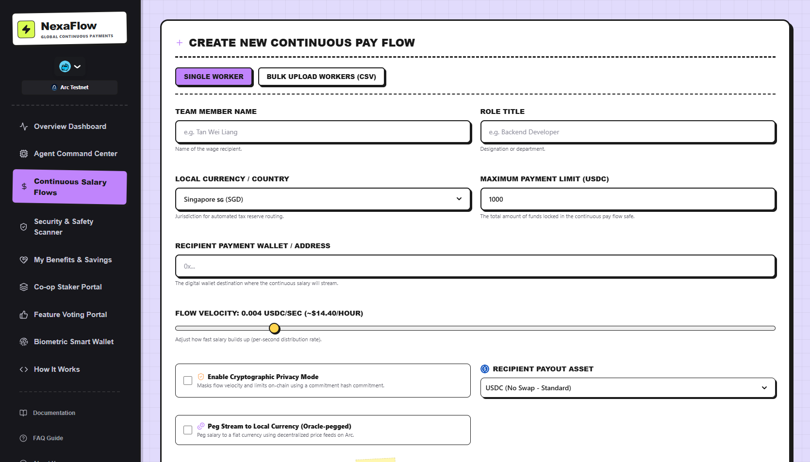
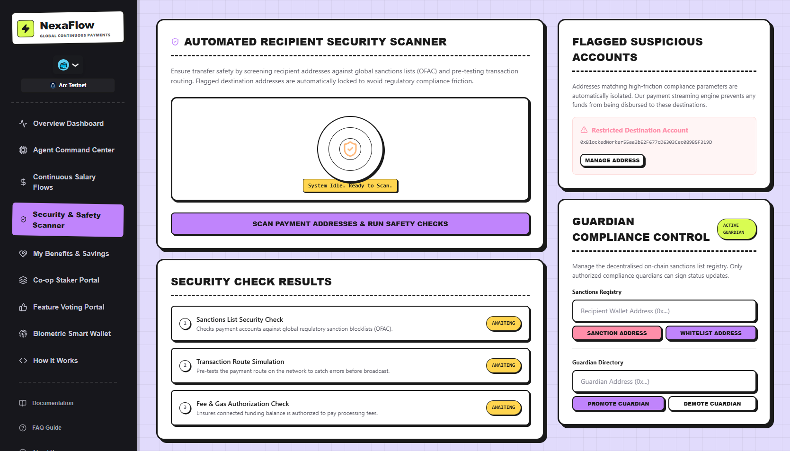
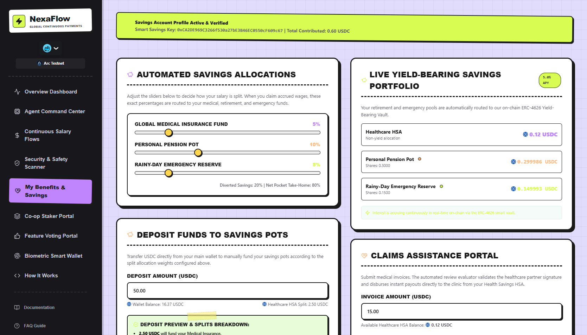
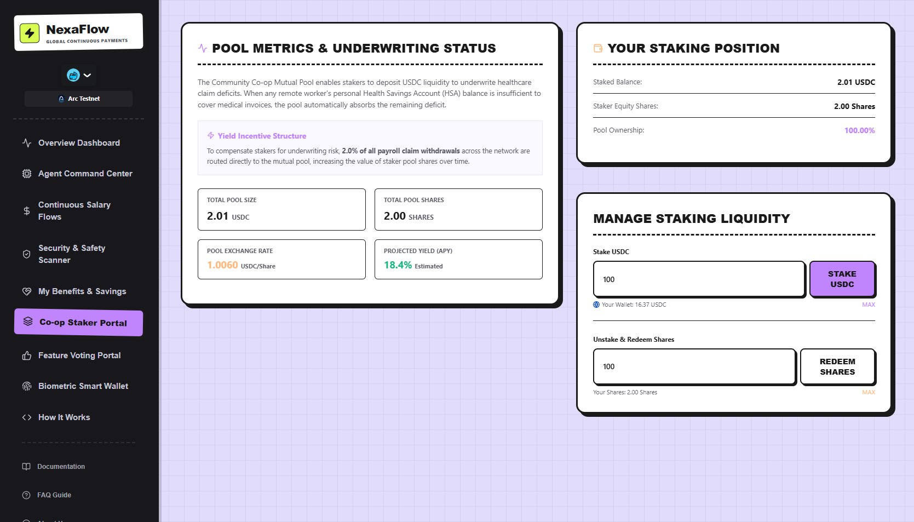
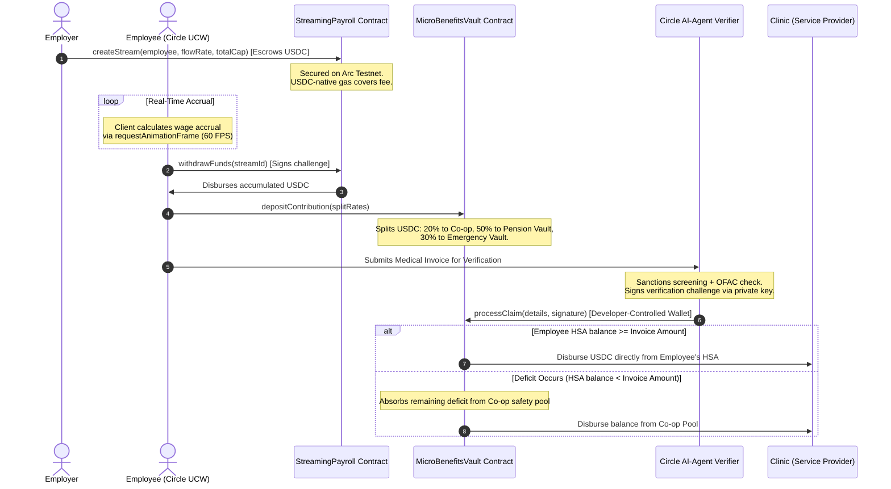
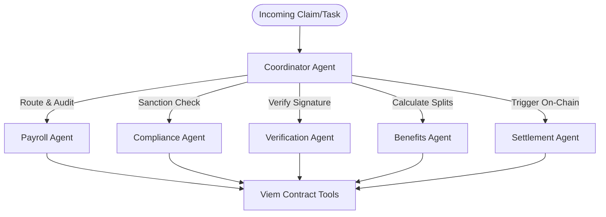

# NexaFlow — Autonomous Continuous Payroll & Decentralized Micro-Benefits Ledger

*Built with Circle Programmable Wallets, x402 Nanopayments, and LangGraph-powered Autonomous AI Agents.*


---

[](LICENSE)
[](https://testnet.arcscan.app/)
[](https://developers.circle.com/)
[](https://langchain-ai.github.io/langgraph/)

NexaFlow is a world-class, enterprise-ready Web3 payroll and micro-benefits platform built natively on **Arc Testnet** (where USDC is the native gas asset). It replaces legacy, rent-seeking batch payroll operations (characterized by high SWIFT fees, multi-day delays, and complex administrative overhead) with **per-second continuous salary streaming** and **AI-agent authenticated benefits splits**.

By uniting real-time streaming liquidity with automated, AI-agent verified micro-insurance and pension disbursements under a sub-second finality model, NexaFlow delivers a secure, highly scalable, and regulatory-compliant stablecoin commerce stack for the global remote workforce.

---

### **🔗 Submission Hub**
* **Live Web App**: [https://nexaflow.vercel.app](https://nexaflow.vercel.app) *(Deploy Placeholder)*
* **Interactive Pitch Deck**: [NexaFlow Pitch Slides](docs/pitch-deck.pdf) *(Local Document)*
* **4-Minute Demo Video**: [Watch NexaFlow in Action](https://youtube.com/watch?v=demo-placeholder) *(Video Link)*
* **Contract Explorer**: [ArcScan Blockchain Explorer](https://testnet.arcscan.app/address/0xDb671f29A8A95099F2546C6862680134737Fe178)

---

# 🚀 60-Second Overview

* **The Problem**: 1.5 billion remote freelancers face expensive cross-border wire delays, lack automated health/retirement savings accounts, and clinic reimbursement processes are manual, slow, and prone to fraud.
* **The Solution**: An autonomous payroll ledger where salary streams continuously per-second. Employees set percentage splits that route in real-time to a healthcare HSA, emergency fund, and retirement pot (ERC-4626).
* **The AI Agent Integration**: Five specialized agents orchestrated via LangGraph verify invoices, negotiate clinic discounts, check OFAC sanctions, and settle claims instantly.
* **The Circle Stack**: Uses **Circle User-Controlled Wallets** for secure employee identities, **Developer-Controlled Wallets** for automated payments, and **x402 Nanopayments** for pay-per-request agent calls.
* **The Arc Chain Advantage**: Real-time streaming powered by Arc Network. Native USDC gas eliminates transaction complexity and guarantees sub-second block confirmation times.

---

# 🔍 The Problem

Traditional payroll and benefits administration is broken for global, decentralized teams:
1. **The Delayed Settlement Gap**: Monthly or bi-weekly pay cycles trap earned capital. Employees work for 30 days before receiving purchasing power.
2. **Cross-Border Frictions**: Wire transfers, intermediary banking loops, and currency spreads consume 3-7% of payout volume.
3. **The Benefits Void**: International contractors are excluded from standard pension plans, dental plans, and health insurance.
4. **Manual & Slow Reimbursement**: Claiming medical bills requires uploading papers, waiting 15-30 days for manual audit teams, and experiencing reimbursement lags.
5. **Security & Compliance Hazards**: Verifying if a remote wallet belongs to a sanctioned entity is slow and requires constant manual compliance checks.

---

# 💡 The Solution

NexaFlow re-engineers global compensation into a real-time, compliance-safe, automated flow:
* **Per-Second Streaming Payroll**: Employers lock USDC into an escrow contract. Funds flow directly to the employee's wallet second-by-second. The employee can withdraw accumulated wages at any moment.
* **Automated Yield-Bearing Splits**: When salary is claimed, customizable splits automatically route to dedicated savings pots. Retirement and emergency balances are immediately deposited into a yield-bearing ERC-4626 vault.
* **Co-Op Shared Health Pool**: A risk-pooling algorithm where 20% of HSA splits cover member deficits, ensuring medical bills are covered even if an individual's balance is insufficient.
* **Autonomous Agent Verification**: A multi-agent committee scans clinic credentials, verifies cryptographic signatures, cross-references on-chain sanction lists, and processes payouts in seconds.

---

# 📸 Product Showcase

### **1. Landing Page & Marketing Portal**
*The professional entry point to NexaFlow detailing the protocol primitives and architecture.*


### **2. Executive Payroll & Benefits Dashboard**
*Comprehensive workspace showing active salary streams, customizable benefit split configurations, and HSA metrics.*


### **3. AI Agent Command Center**
*The orchestration control panel showcasing active LangGraph agents, live budget allocation, and the Circle Gateway x402 nanopayment ledger.*


### **4. Autonomous Medical Claim Verification**
*DeepSeek v4 agent checking EIP-712 clinic signatures, auditing medical invoice items, and confirming eligibility.*


### **5. Real-Time Sanctions & Compliance Screening**
*Compliance Agent evaluating risk scores and checking target wallets against OFAC and global lists.*


### **6. Automated Circle DCW Payout Settlement**
*The Settlement Agent programmatically dispatching USDC claims directly to verified clinic addresses via Circle Developer-Controlled Wallets.*


### **7. StateGraph Execution Details**
*Detailed logs showing the step-by-step consensus, budget usage, and execution loops of the agent committee.*



# 🛠️ Core Features

1. **Continuous Escrow Streaming**: Tracks salary rates in USDC per second, resolving network congestion through a thread-safe sequential transaction queue.
2. **Yield-Bearing ERC-4626 Vaults**: Seamlessly routes retirement/emergency funds into decentralized vaults, earning interest automatically.
3. **EIP-712 Signed Clinic Claims**: Clinics sign invoices cryptographically; NexaFlow's AI agent verifies and settles them instantly.
4. **On-Chain Compliance Screening**: A compliance registry that query blocks sanctioned addresses in real-time.
5. **x402 Nanopayment Ledger**: Micro-toll billing gates API services, requiring agents to pay tiny USDC fees per-request using Circle Gateway.
6. **Smart Paymaster Delegation**: Integrates paymasters to sponsor gas fees, allowing gasless claims for employees.

---

# 🔄 User Journey

The diagram below outlines the full lifecycle: from establishing the payroll stream to the autonomous verification and payout of medical claims.



---

# 🏗️ Architecture Overview

NexaFlow uses a modern, modular Web3 and AI architecture designed for low-latency and gas efficiency:

```
┌─────────────────────────────────────────────────────────────────┐
│                   NexaFlow React Frontend                       │
│      (AppKit + Circle User-Controlled Wallets PIN Enclave)      │
└────────────────┬────────────────────────────────┬───────────────┘
                 │ Web3 Calls                     │ API Calls
                 ▼                                ▼
┌─────────────────────────────────┐ ┌─────────────────────────────┐
│          Arc Testnet            │ │      AI Agent Server        │
│    (USDC Native Gas Chain)      │ │   (LangGraph Coordinator)   │
├─────────────────────────────────┤ └─────────────┬───────────────┘
│ - StreamingPayroll Contract     │               │ Writes
│ - MicroBenefitsVault Contract   │               ▼
│ - ComplianceRegistry Contract   │ ┌─────────────────────────────┐
│ - ERC-4626 Yield Vault          │ │      Supabase DB &          │
└─────────────────────────────────┘ │   x402 Nanopayments         │
                                    └─────────────────────────────┘
```

## Technical Stack
* **Frontend**: Next.js 16 (Turbopack), Tailwind CSS, Viem, Wagmi, Reown AppKit.
* **Agent Brain**: LangGraph, LangChain, DeepSeek-Chat, ChatOpenAI.
* **On-Chain Layers**: Solidity 0.8.20 (Hardhat), deployed on **Arc Testnet**.
* **Database & Ledger**: Supabase (PostgreSQL) mirroring transaction logs and tracking Circle x402 nanopayment receipts.

---

# 🤖 AI Agent Architecture

Instead of a generic chatbot, NexaFlow orchestrates a **5-Agent Decentralized Committee** inside a LangGraph `StateGraph`. Each agent has specialized tools and a localized budget:



### **Agent Directory**
1. **Coordinator**: Evaluates incoming API requests, registers active agents on-chain via **ERC-8004** (Identity Registry), and routes sub-tasks.
2. **Payroll Agent**: Automates stream creation, monitors employer balances, and issues top-up warnings when vaults fall below 14 days of payroll coverage.
3. **Verification Agent**: Extracts metadata from medical bills, authenticates the medical provider's signature, and computes EIP-712 struct hashes.
4. **Compliance Agent**: Interfaces with Circle's Compliance endpoints and check blocks sanctioned addresses.
5. **Settlement Agent**: Interacts directly with **Circle Developer-Controlled Wallets** to sign transactions and execute payouts.

---

# 🌐 Circle Technologies Integration

NexaFlow relies on Circle's Web3 and API stack to provide a smooth user experience and automated treasury management:

* **Circle User-Controlled Wallets (UCW)**: Used as the primary identity for employees. Non-custodial security ensures employees own their wage flows and benefit balances while signing transactions through secure PIN challenges.
* **Circle Developer-Controlled Wallets (DCW)**: Programmatic wallets used by the Settlement Agent to sign verification payouts and manage treasury buffers automatically.
* **x402 Nanopayments**: Every API request to our compliance or verification agents triggers a micro-toll using the x402 protocol, settled via Circle Gateway.
* **Native USDC**: The core currency of NexaFlow. Serves as the payroll stream asset, the benefits collateral, and the native gas token on Arc Chain.

---

# 📜 Smart Contracts

Our contracts are deployed on the **Arc Testnet**:

| Contract Name | Address | Purpose / Key Responsibilities |
| :--- | :--- | :--- |
| **StreamingPayroll** | `0xDb671f29A8A95099F2546C6862680134737Fe178` | Manages per-second salary streaming and locked employer escrows. |
| **MicroBenefitsVault** | `0x14624dCDf725B10A04763Dd503DC6f26Da295771` | Manages HSA balances, retirement/emergency splits, and the Co-op pool. |
| **TreasuryBufferManager** | `0x304c6282246229eAD2df763Be789FdA076BD799d` | Monitors employer solvency, calculates days of coverage, and runs warnings. |
| **PaymasterRulesManager**| `0x5057Ed983efEa1904B55aF36c37557584184F125` | Defines paymaster criteria, allowing gasless claims for registered workers. |
| **ComplianceRegistry** | `0x2b8916bd1Ba674097444C280aB78Debb866D46E3` | Maintains global sanction states and enables quick compliance updates. |

---

# 🔒 Security Model

NexaFlow implements a multi-layered security model to protect developer treasuries and employee funds:
* **EIP-712 Signature Domain**: All medical claim payloads must be signed by the Verifier Agent. The smart contract validates this signature to prevent replay attacks.
* **Role-Based Access Control**: Functions like `processClaim()` are protected by the `onlyCleared` and `onlyVerifier` modifiers, ensuring only authorized AI Agents can trigger disbursements.
* **Solvency Invariants**: The `StreamingPayroll` contract enforces that the locked contract balance must always be greater than or equal to the sum of remaining unwithdrawn streams:
  $$\text{Balance}_{USDC}(\text{Contract}) \ge \sum_{i=1}^{N} \left( C_i - P_{claimed, i} \right)$$
* **Non-Custodial Escrow**: Employer payroll streams are locked in escrow, ensuring funds cannot be modified or re-allocated without owner consensus or stream cancellation.

---

# 📂 Repository Structure

```
NexaFlow/
├── contracts/                  # Solidity Smart Contracts (Hardhat)
├── server/                     # Express.js Backend Server
│   ├── agents/                 # LangGraph Multi-Agent Coordinators
│   │   ├── coordinator.js      # Agent StateGraph & System Prompt
│   │   └── tools.js            # Viem Web3 On-Chain Tools
│   ├── database.js             # Supabase ORM & Log Mirroring
│   └── middleware/             # Circle x402 Nanopayments
├── src/                        # Next.js React Frontend Client
│   ├── app/                    # Next.js Routing Pages
│   ├── components/             # Reusable UI Elements (Icons, Badges)
│   ├── context/                # NexaFlow React Context (Wagmi Hooks)
│   └── contracts.js            # Deployed ABIs & Addresses
├── public/                     # Product Visuals & Screenshots
├── .env.example                # Unified Environment Variable Template
└── README.md                   # Complete Project Documentation
```

---

# 💻 Developer Experience (Local Setup)

Follow these steps to run the complete NexaFlow stack locally:

### 1. Prerequisites
* Node.js v18+
* Git
* A Supabase project

### 2. Installation
```bash
git clone https://github.com/miamailasol/NexaFlow.git
cd NexaFlow
npm install
```

### 3. Environment Setup
Copy the env template and fill in your keys:
```bash
cp .env.example .env
```
Ensure `PRIVATE_KEY`, `CIRCLE_API_KEY`, `DEEPSEEK_API_KEY`, and `SUPABASE_URL` are configured.

### 4. Running the Stack
Launch the frontend client, the backend agent coordinator, and the database synchronization server concurrently:
```bash
npm run dev:all
```
* **Frontend Dashboard**: `http://localhost:3000`
* **Agent Coordinator API**: `http://localhost:3012`

---

# ⚖️ Competitive Advantage

| Feature | Legacy Payroll (Deel/Remote) | Basic Web3 (Sablier/Superfluid) | NexaFlow |
| :--- | :--- | :--- | :--- |
| **Payout Latency** | Monthly / Bi-weekly | Per-second | **Per-second** |
| **Fees** | 3-7% wire fees + FX spread | Standard network gas | **USDC Sponsored Gas (Gasless)** |
| **Benefit Splits** | Manual & country-restricted | None | **Automated HSA / Pension (ERC-4626)** |
| **Claims Auditing** | Manual (15-30 days) | Manual admin trigger | **Autonomous AI-Agent (Sub-second)** |
| **Sanctions Compliance**| Manual checks | Wallet-only blocking | **On-Chain Compliance Registry** |

---

# 🗺️ Roadmap

- [x] **Phase 1: Foundation (Hackathon Proof-of-Concept)**
  - Deployed core Streaming and Benefits smart contracts.
  - Set up the Next.js client and the LangGraph agent server.
- [ ] **Phase 2: Mobile Integration & Passkeys (Near-Term)**
  - Add Circle Smart Account Passkey login for gasless mobile onboarding.
  - Implement EURC/USDC multi-stablecoin swaps via on-chain routers.
- [ ] **Phase 3: Multi-Chain Streaming (Mid-Term)**
  - Support cross-chain payroll streams using USDC via Chainlink CCIP and Circle CCTP.
- [ ] **Phase 4: Enterprise Scale (Long-Term)**
  - Add native payroll integrations for popular platforms like Workday and Deel.


# 📝 Why We Built This

NexaFlow was born from our experiences working as remote Web3 contractors. We saw firsthand how much time and money are lost to cross-border banking fees, and how difficult it is for freelancers to set up long-term savings plans.

By building on **Arc Testnet** and leveraging **Circle's Programmable Wallets**, we realized we could completely remove these friction points. With NexaFlow, employees are paid continuously, and their health and retirement savings are managed automatically by secure AI Agents. We believe this is what the future of global work looks like.

---

# 📄 Contributing & License

Contributions are welcome! Please read `CONTRIBUTING.md` before submitting a pull request.

This project is licensed under the [MIT License](LICENSE).

